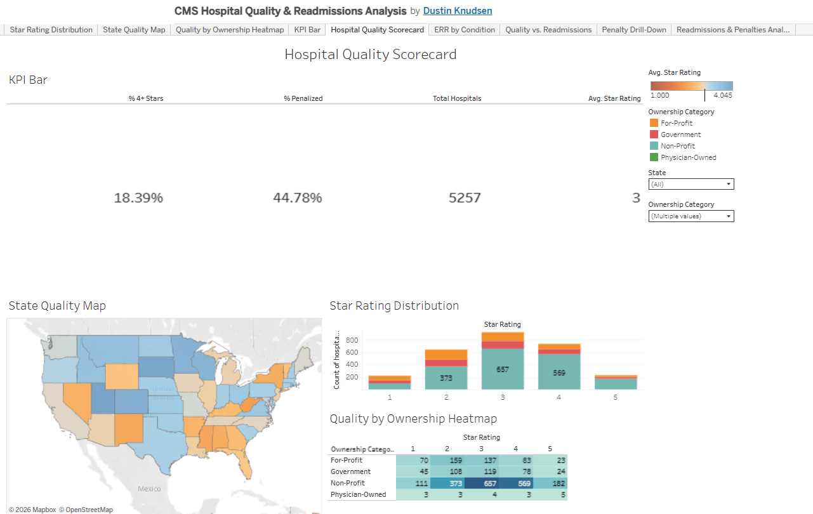
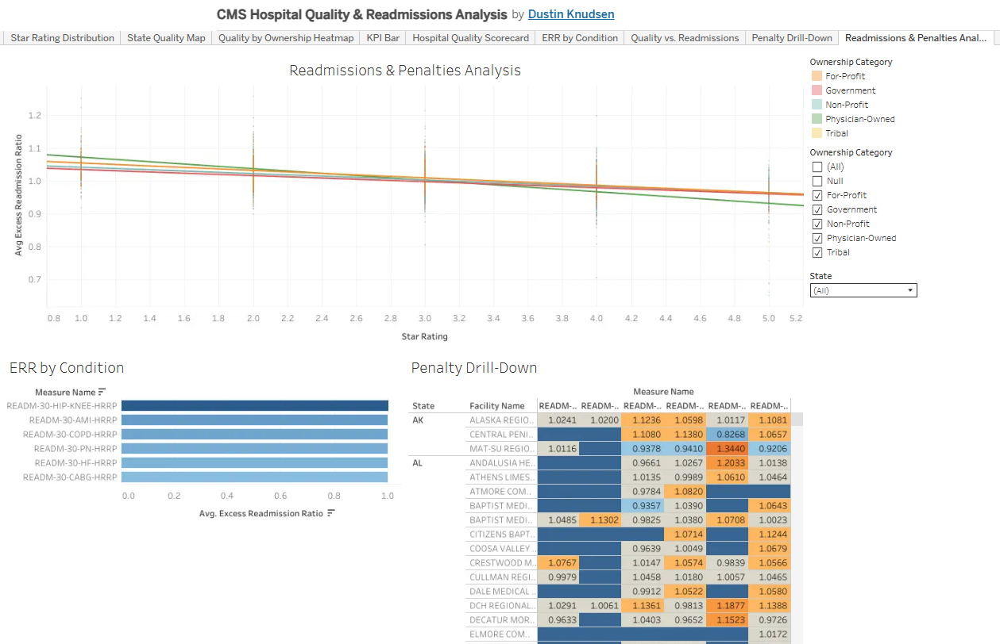

End-to-end healthcare data engineering and analytics project using publicly available CMS (Centers for Medicare & Medicaid Services) datasets. Demonstrates Python ETL pipeline development, data quality validation, SQL transformations, and Tableau/Power BI dashboard creation.

## Live Dashboards

**Tableau Public** [CMS Hospital Quality & Readmissions Analysis]
(https://public.tableau.com/app/profile/dustin.knudsen/viz/CMSHospitalQualityReadmissionsAnalysis/HospitalQualityScorecard)

 ### Hospital Quality Scorecard
 

 ### Readmissions & Penalties Analysis
 

## Project Overview

This project analyzes hospital quality, readmissions, and cost data from CMS Provider Data Catalog to surface actionable insights for healthcare operations and quality improvement teams.

### Dashboards

| Dashboard | Description | Data Source |
|-----------|-------------|-------------|
| **Hospital Quality Scorecard** | Star ratings, quality measures, and safety indicators across 4,000+ hospitals | CMS Hospital Compare |
| **Readmissions & Penalties** | HRRP penalty analysis, excess readmission ratios by diagnosis group, geographic patterns | CMS Readmissions Reduction Program |


### Architecture

```
CMS Provider Data Catalog (REST API)
        │
        ▼
┌─────────────────────┐
│  Python ETL Pipeline │  ← extract_cms_data.py
│  - API extraction    │
│  - Data validation   │
│  - Quality checks    │
│  - Deduplication     │
└────────┬────────────┘
         │
         ▼
┌─────────────────────┐
│  Transform & Enrich  │  ← transform_hospital_data.py
│  - Joins & lookups   │
│  - Calculated fields │
│  - Aggregations      │
│  - SCD handling      │
└────────┬────────────┘
         │
         ▼
┌─────────────────────┐
│  Data Quality Layer  │  ← validate_data.py
│  - Schema validatio  │
│  - Null checks       │
│  - Range validation  │
│  - Referential integ │
└────────┬────────────┘
         │
         ▼
┌─────────────────────┐
│  Tableau / Power BI  │
│  - Published to      │
│    Tableau Public    │
└─────────────────────┘
```

## Tech Stack

- **Python 3.11+**: ETL orchestration, data validation, API integration
- **pandas / polars**: Data transformation and analysis
- **requests**: CMS Provider Data Catalog REST API
- **pytest**: Unit tests for ETL logic
- **Tableau Desktop / Tableau Public**: Dashboard visualization
- **SQL (T-SQL/PostgreSQL)**: Analytical queries and data validation
- **Git**: Version control with feature branching

## Quick Start

```bash
# Clone the repo
git clone https://github.com/dustinjknudsen/healthcare-analytics-portfolio.git
cd healthcare-analytics-portfolio

# Install dependencies
pip install -r requirements.txt

# Run the full ETL pipeline
python etl/extract_cms_data.py        # Pull data from CMS API
python etl/transform_hospital_data.py  # Clean, join, enrich
python etl/validate_data.py           # Run data quality checks

# Output: processed CSVs in data/processed/ ready for Tableau
```

## Data Sources

All data sourced from [CMS Provider Data Catalog](https://data.cms.gov/provider-data/): publicly available, no PHI, no HIPAA concerns.

| Dataset | CMS ID | Records | Updated |
|---------|--------|---------|---------|
| Hospital General Information | `xubh-q36u` | ~5,300 | Quarterly |
| Readmissions Reduction Program | `9n3s-kdb3` | ~50,000 | Annually |
| Timely and Effective Care | `yv7e-xc69` | ~250,000 | Quarterly |
| Medicare Spending Per Beneficiary | `rrqw-56er` | ~5,000 | Annually |

## ETL Pipeline Details

### Extract (`etl/extract_cms_data.py`)
- Pulls data via CMS Provider Data Catalog REST API
- Handles pagination (API returns max 500 rows per request)
- Implements retry logic with exponential backoff
- Logs extraction metrics (row counts, timestamps, API response codes)

### Transform (`etl/transform_hospital_data.py`)
- Joins hospital demographics with quality/cost/readmission data
- Computes derived metrics: penalty rates, quality composites, cost indices
- Handles data type standardization and null imputation
- Generates state-level and region-level aggregations

### Validate (`etl/validate_data.py`)
- Schema validation against expected column types
- Null/missing value thresholds per field
- Range checks on numeric measures
- Referential integrity between datasets
- Outputs data quality report as JSON

## Project Structure

```
healthcare-analytics-portfolio/
├── README.md
├── requirements.txt
├── etl/
│   ├── extract_cms_data.py
│   ├── transform_hospital_data.py
│   ├── validate_data.py
│   └── config.py
├── data/
│   ├── raw/           # Raw API extracts (gitignored)
│   ├── processed/     # Transformed, analysis-ready CSVs
│   └── sample/        # Sample data for testing
├── sql/
│   ├── analysis_queries.sql

├── tests/
│   ├── test_extract.py
│   ├── test_transform.py
│   └── test_validate.py
├── dashboards/
│   └── README.md      # Tableau Public links + screenshots
├── docs/
│   └── data_dictionary.md
└── .gitignore
```

## Author

**Dustin Knudsen**: BI / Analytics Engineer  
Contract BI/Analytics Engineer with 8+ years building data systems, ETL pipelines, and reporting infrastructure. Specializes in Tableau, Power BI, and SQL for internal corporate analytics.  
[Tableu Public](https://public.tableau.com/app/profile/dustin.knudsen) | [LinkedIn](https://linkedin.com/in/dustinknudsen) | [GitHub](https://github.com/dustinjknudsen)
